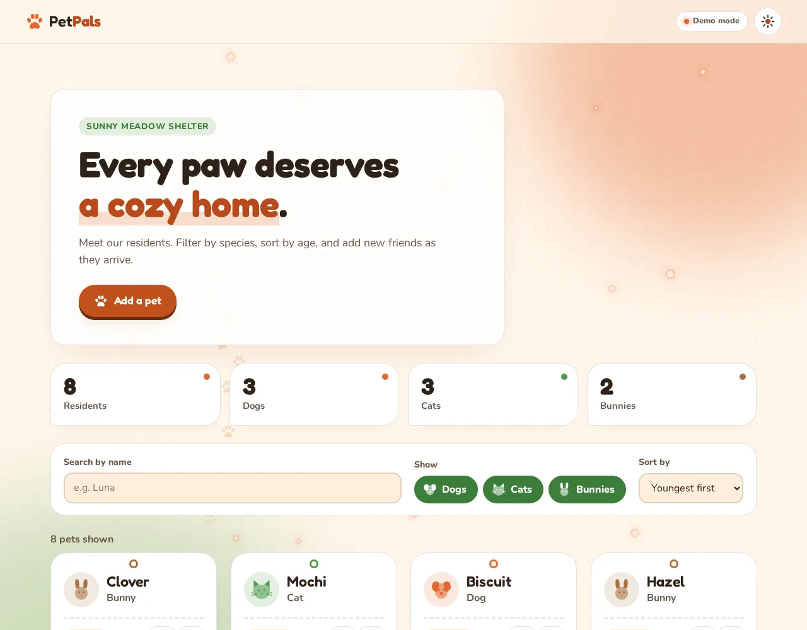
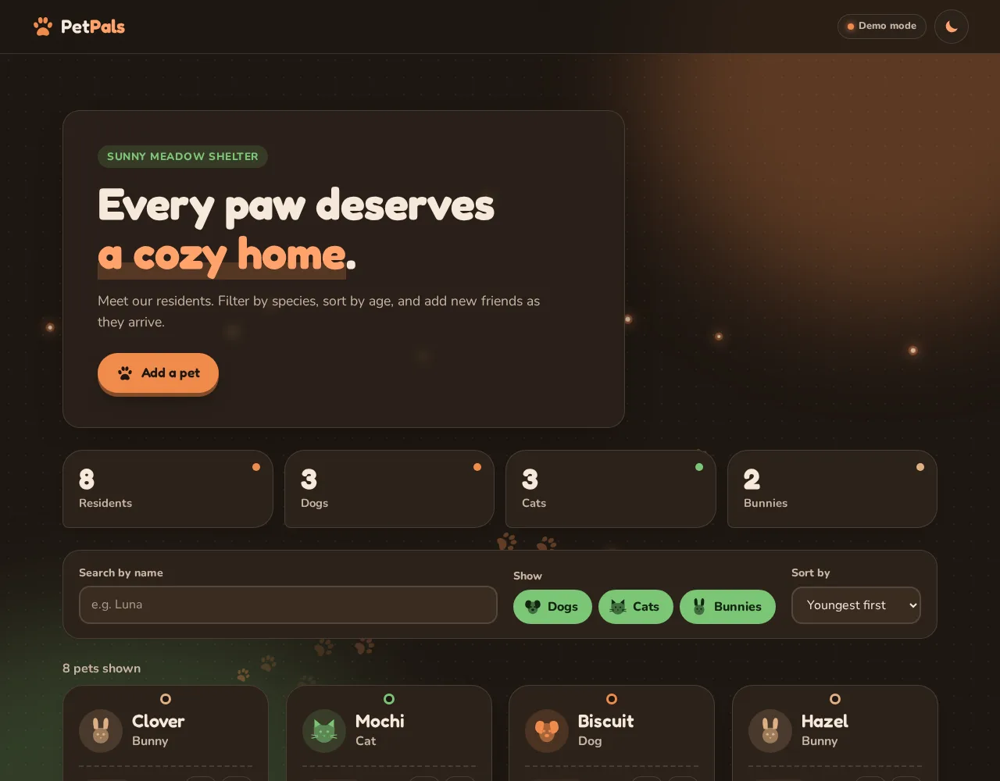
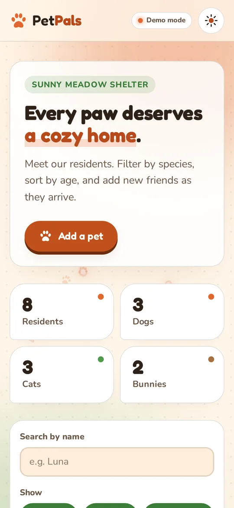

[English](README.md) · **Lietuvių**

# 🐾 PetPals

Jaukus gyvūnų prieglaudos sąrašas: gyvūnus galima filtruoti, rūšiuoti, pridėti, redaguoti ir ištrinti. Veikia su REST API, sukurtu su Express ir MongoDB.

**[Gyvas demo](https://brutall100.github.io/petpals-express-mongodb/)** · **[Kodas](https://github.com/brutall100/petpals-express-mongodb)**



<p>
  
  
</p>

## Apie projektą

PetPals prasidėjo kaip Node.js backend pratimas: mažas API gyvūnų sąrašui. Perdariau jį į pilną programėlę su visomis **CRUD** operacijomis (sukurti, skaityti, atnaujinti, ištrinti), tvarkingu frontend'u ir draugišku „Pėdutės pievoje“ dizainu.

Programėlė turi **du režimus**:

| Režimas | Kur | Kur saugomi duomenys |
|---|---|---|
| 🟠 **Demo** | GitHub Pages ar bet kuris statinis hostingas | tavo naršyklėje (`localStorage`) |
| 🟢 **Tikras serveris** | `npm start` tavo kompiuteryje | MongoDB, per Express API |

Pasikrovęs puslapis patikrina `api/health`. Jei serveris atsako, puslapis naudoja API. Jei ne, įsijungia demo, todėl gyva nuoroda visada veikia.

## Galimybės

- 🐶 **Pilnas CRUD**: gyvūnus galima pridėti, redaguoti ir ištrinti. Duomenys tikrinami ir naršyklėje, ir serveryje
- 🔎 **Filtrai, paieška, rūšiavimas**: šunys, katės, triušiai; paieška pagal vardą; rūšiavimas pagal amžių, vardą ar atvykimo datą
- 📊 **Gyva statistika**: pasikeitus sąrašui, skaičiai „suskaičiuoja“ iki naujos reikšmės
- 🐾 **Gyvas fonas**: per pievą eina pėdučių takeliai, į viršų kyla pienių pūkai
- 🌗 **Šviesus ir tamsus režimai**: pagal sistemos nustatymą, su perjungimo mygtuku, įsimena pasirinkimą ir nesumirgi kraunantis
- 📱 **Pritaikyta telefonui** (iki 390 px), be slinkimo į šoną
- ♿ **Prieinama**: „Skip to content“ nuoroda, matomas fokusas, laukeliai su etiketėmis, WCAG AA kontrastas, palaikomas `prefers-reduced-motion`
- 🔒 **Saugu**: gyvūnų vardai apsaugoti nuo HTML įterpimo, slapti duomenys laikomi `.env` faile, serveris rodo tik viešus aplankus

## Naudotos technologijos

- **Backend:** Node.js, Express 4, MongoDB Node tvarkyklė 6, dotenv
- **Frontend:** HTML, CSS (kintamieji, `color-mix`, `<dialog>`) ir paprasti JavaScript moduliai, be karkasų
- **Šriftai:** [Fredoka](https://fonts.google.com/specimen/Fredoka) antraštėms, [Nunito](https://fonts.google.com/specimen/Nunito) tekstui

**Paletė „Pėdutės pievoje“**

| Paskirtis | Šviesus | Tamsus |
|---|---|---|
| Fonas | `#FFF6E9` | `#1E1712` |
| Paviršius | `#FFFFFF` | `#2C221B` |
| Tekstas | `#2E2118` | `#F6E9DA` |
| Akcentas: oranžinė | `#E2672F` (mygtukai `#C2511C`) | `#F08A4B` |
| Akcentas: žolės žalia | `#4E9A4A` (filtrai `#3B7D38`) | `#7CC576` |

Visos spalvos laikomos vienoje vietoje: `:root` bloke failo [`css/style.css`](css/style.css) viršuje.

## Ką išmokau

- Kurti REST API su Express: maršrutus, būsenos kodus (`201`, `204`, `400`, `404`) ir vieną klaidų tvarkyklę visiems maršrutams
- Dirbti su MongoDB: `find` su filtrais, `sort`, `insertOne`, `findOneAndUpdate`, `deleteOne` ir `ObjectId`
- **Maršrutų tvarka svarbi.** Senoje versijoje `/pets/:type` stovėjo aukščiau už `/pets/byoldest`, todėl antrasis maršrutas niekada nesuveikdavo
- Prisijungti prie duomenų bazės vieną kartą paleidžiant serverį, o ne per kiekvieną užklausą
- Laikyti slaptus duomenis `.env` faile ir niekada jo nekelti į Git
- Apsaugoti vartotojo įvestį prieš dedant ją į HTML
- Padaryti, kad tas pats puslapis veiktų ir su serveriu, ir be jo

## Kaip paleisti savo kompiuteryje

Reikia **Node.js 20+** ir MongoDB duomenų bazės (nemokamo [MongoDB Atlas](https://www.mongodb.com/atlas) klasterio arba vietinės MongoDB).

```bash
git clone https://github.com/brutall100/petpals-express-mongodb.git
cd petpals-express-mongodb/server
npm install
cp .env.example .env     # tada atidaryk .env ir užpildyk
npm run seed             # nebūtina: prideda 8 pavyzdinius gyvūnus
npm start                # atidaryk http://localhost:3000
```

Ką įrašyti į `.env`:

| Kintamasis | Reikšmė |
|---|---|
| `PORT` | Vietinio serverio portas, pvz., `3000` |
| `MONGO_URI` | Tavo MongoDB prisijungimo eilutė (Atlas → Connect → Drivers) |
| `DB_NAME` | Duomenų bazės pavadinimas, pvz., `petpals` |

Jei nori tik **demo** be serverio, atidaryk projektą su bet kuriuo statiniu serveriu (pvz., VS Code plėtiniu *Live Server*).

### API

| Metodas | Maršrutas | Ką daro |
|---|---|---|
| `GET` | `/api/health` | Patikrina, ar serveris veikia |
| `GET` | `/api/pets?type=dog,cat&sort=age_desc&search=lu` | Gyvūnų sąrašas (filtras, rūšiavimas, paieška) |
| `GET` | `/api/pets/:id` | Vienas gyvūnas |
| `POST` | `/api/pets` | Prideda gyvūną: `{ "name": "Luna", "type": "cat", "age": 5 }` |
| `PUT` | `/api/pets/:id` | Atnaujina gyvūną |
| `DELETE` | `/api/pets/:id` | Ištrina gyvūną |

`sort` gali būti `age_asc`, `age_desc`, `name` arba `newest`.

## Projekto struktūra

```text
petpals-express-mongodb/
├── index.html            # puslapis
├── favicon.svg
├── css/style.css         # visi stiliai; paletė pačiame viršuje
├── js/
│   ├── theme-init.js     # nustato temą prieš piešiant puslapį (be mirgėjimo)
│   ├── app.js            # sąsaja: kortelės, filtrai, langai, statistika
│   ├── store.js          # duomenys: tikras API arba demo naršyklėje
│   └── background.js     # pėdučių takeliai ir pienių pūkai
├── data/sample-pets.json # pavyzdiniai gyvūnai demo ir seed skriptui
├── api/health            # GitHub Pages svetainei praneša naudoti demo
├── docs/                 # ekrano nuotraukos
└── server/
    ├── server.js         # Express + MongoDB API
    ├── seed.js           # prideda pavyzdinius gyvūnus
    ├── .env.example      # nustatymų šablonas
    └── package.json
```

## Padėkos

- Šriftai Fredoka ir Nunito iš [Google Fonts](https://fonts.google.com) (SIL Open Font License)
- Gyvūnų vardai išgalvoti. Visos ikonos ir piešinėliai nupiešti SVG būtent šiam projektui.

## Licencija

[MIT](LICENSE) © 2026 brutall100
